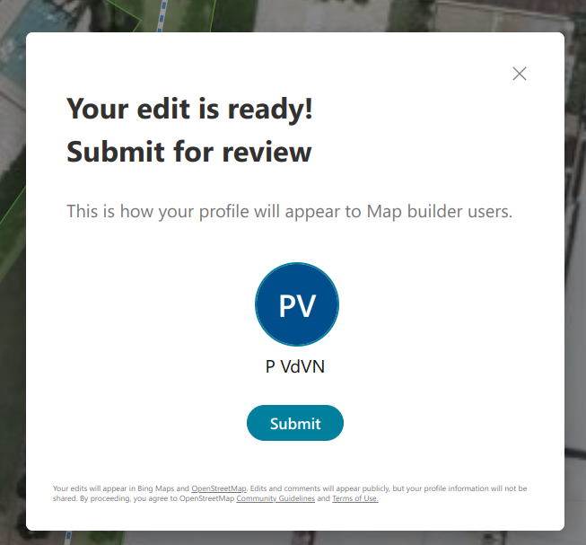

# OpenStreetMap is in trouble

It is a long-standing tradition that every now and then, a member of the OpenStreetMap-community posts that OSM is in trouble.
Often times, these essays complain about some trivial things which are, in the end, not that important. For example, they complain that we didn't implement Bézier curves yet (we don't need them), or that the data model is stale (it isn't, new tagging appears every day), that the main OSM.org website doesn't have some feature and isn't on par with Google Maps (that's by intent) or that AI will make the entire manual mapping space obsolete, in "just another ten years time".

However, most of these things miss the crucial point of what OSM is: a community; a group of people that are working together on mapping the world in an Open Data way and building related tools with Open Source.
Our strength is the unison in this goal, even though everyone pursues this differently, through different technological means and for different motivations. Motivations range from the most mundane reasons up till political activism.
And that's fine. All this activity and diversity strengthens us as a global community.

However, recently, a new participant has entered the ecosystem with parasitic intents.
It tries to capture away precisely what makes OSM strong: the contributors.

The means to this end is called 'Bing Map Builder'.

## A bit of history

As you all are aware, OpenStreetMap-data is republished under the [Open Database Licence](https://openstreetmap.org/copyright). This means that everyone can use OSM-data for all purposes (including commercial purposes), but they have to honour two obligations:

- You have to attribute OSM
- Changes to the data have to be shared again under the same licence

I'm glossing over some of the technical details, but the spirit is that the licence is contagious.
I argue that this is one of the big reasons that OSM has become the successful project in this space, and I argue that two other important projects are successful thanks to a similar contagious licence: Wikipedia uses [Creative Commons with Attribution and Share-alike](https://en.wikipedia.org/wiki/Wikipedia:Copyrights), the Linux Kernel uses the [GNU General Public Licence](https://www.kernel.org/doc/html/latest/process/license-rules.html) which is share alike similarly.

All this serves a specific purpose: it binds people using the data or tools to contribute back their little bit of help.
On an individual scale, this contribution is negligible; yet all those little drops become a huge river together.
These licences force us to unite under a common banner, to put the community above the individual.

I'm not blind to some of the drawbacks that this approach has. I've been in many meetings with interested parties where this licence proved to be puzzling to the uninitiated or where the share-alike licence was outright incompatible with their goals; even though these goals were to publish open data from the government! The share-alike-license is often incompatible with the obligated public-domain-license they sometimes have to use.

Yet, I'm still convinced that using a CC0-license for OSM would kill the project instantly. Consider, hypothetically, that every contributor whoever made a change would agree to convert all their previous contributions to CC0, what would happen (1)?

A data run would happen. Every actor out there, big _and_ small, would grab a copy of OSM and go their own way with it.
I've seen countless similar projects, but all focused on a small scope, all in varying states, such as [Open Benches](https://openbenches.org/), [Camper sites](https://www.dewielen.be/campers), [Slipways](https://www.trailerhelling.com/en/index.html), [charging stations](https://map.openchargemap.io/) [AEDs](https://play.google.com/store/apps/details?id=be.prior_it.evapp), and then I'm not mentioning the thousands of maps on municipality websites.

All of them would grab a partial copy of OSM with only the data that they are interested in and try to wall them off and build their own community around it, effectively splintering OSM-contributors into thousands of niche communities.

The result would be that more work should be done in total, for way worse data quality as the data would not be integrated any more.
Tooling and software would become just as fragmented, killing the quality of the software too.

So, even though the direct move of using CC0 for the OSM-data can be considered "more open", it would in the end be a big net negative for Open Data.

The biggest victims of this move would be the OSM-based general purpose consumer applications (OsmAnd, Maps.me, Organic Maps, ...). They don't have a specialized community around them, and they would see their road network and POI data going stale, slowly forcing them out of the market.

The biggest winners would be the _closed source_ mapping applications run by big corpos, such as Google Maps, Apple Maps and Bing Maps.
They have access to resources we can only dream of. Where we had to do with a volunteer sysadmin for over a decade (2), setting up a map database is not that difficult for such a big organization who can hire a team right away. They can buy basic datasets from specialized companies without much ado, and they have access to people via their respective devices. These devices can help to build the map data via prompting the user ("what is the phone number of the restaurant you just visited?") or by spying on them (e.g. movement data to build road networks, max speeds, and one ways) - which gives them a big bonus.

### A confession

A bit of a sidenote: it is not necessarily bad to have a subcommunity within OSM which is focused on a specific subject (e.g. trees, or artworks, or cycling related stuff) - as long as they all play along nicely with the wider ecosystem, that is a huge bonus. Even more so (and this is a disclaimer of my huge bias): as developer of MapComplete, I'm building precisely those tools to give such a subcommunity the means to focus on just a single topic. However, under the surface, a lot of the code tries to make sure that those tools integrate well with the data by trying to prevent duplicates or make links to other themes. And the interface also guides new contributors to discover the other topics and other editors so that they can grow into a better contributor and community member as well.

Another confession: at my job at Anyways, we have done precisely this fragmenting of data, by creating a small map where only a few people can edit.
But before you grab the pitchforks: those sandboxed (and private) copies of OSM serve to study possible transportation changes in the city. The researcher makes hypothetical changes (such as closing a street for through traffic or building a new cyclist bridge) and can then see how cars/cyclists/pedestrians would behave in the new scenario. As such, this data is not suited for OSM in the first place. Even better, as we reuse the iD-editor, 
those researchers gain OSM-experience and often update OSM themselves once the mobility changes go into effect.

## The current situation

To get back to reality, we see that Google Maps is a runaway consumer success, partly due to the gigantic access that google has to people's daily lives and due to the deep pockets that google has to fund this all. Furthermore, thanks to the coupled sales of the Play Store, Google Maps is pre-installed on every sold Android phone which drives hoards of people to use Google Maps.

Several other big companies - most notably Apple, but also Microsoft - have tried to emulate this, without much success.
The non-google platform companies have a weak spot there. On one hand, they really need a map to offer a feature-complete device (and to get access to that sweet geo-data of consumers). They can't rely on Google Maps by Alphabet Inc. - it's their biggest competitor. If they did a price hike or cut access to their services, they would be severely crippled.
At the same time, keeping a world-wide up-to-date map costs billions of dollars _annually_ - a hefty sum to pay alone.
And yet, they are all so _envious_ of Google Maps. They all want to have it, but only one can be the top contender.

And then there is this weird (3) project that gather extremely qualitatively data on a big scale and gives it away, for _free_. Why would anyone do so much work without asking money for it?

But even better would be that all those people would do this work for free, but in a way that contributes to the bottom line of the corporation.
In the end, many people contribute to Google Maps, Waze and quite some other projects where they sign away their rights to that company. And let us face it: Microsoft would love to get a contributor base for bing maps - and they are working towards this goal, piggybacking on the efforts of OpenStreetMap. Bing Map Builder is a first attempt to do this.

## What does Map-Builder do (on the surface)?

The map-builder is discoverable through bing maps if you are browsing around in Australia. If you are browsing around there, an extra button appears in the bottom right with "edit maps" just above the 'Feedback'-button. Additionally, a big banner is shown on top which invites people to make map edits.

Once opened, you are greeted by a modified iD editor which has a nice tutorial which invites drawing a building, a road or a water body (4).

This sometimes goes wrong horribly. In this case, the map builder didn't realize that the water body was already there. I started improving the geometry of it, after which I was completely unable to actual save and upload this... The 'save' button correctly realized that there was one change, but I couldn't click it. Unselecting the feature gave a warning with the choice to 'continue tracing' or to 'exit'.
Continue tracing did take me back to the broken state and clicking 'exit' resulted in my changes being erased.

The last important feature shows messages and changeset comments in the editor itself. It is a nice feature which I would like to see upstreamed in the editor. The reason that this button has been added, however, is due to dark reasons.

## What does MapBuilder actually do?

### It edits **bing** maps! Right?

Have a good look at the previous screenshots. 
Something that is completely missing, unless you go and search for it very deeply.
Do you know what is missing?

.... Take your time, scrutinize the screenshots ....

In case you haven't realized yet: there is _no_ mention of OpenStreetMap in sight.

It is mentioned somewhat if you open up the tutorial page and there is a 'view on OpenStreetMap button' if you open up the sidebar, hidden away in the top left.

In the same vein, there is no clear step where contributors have to agree to the contributor terms.
This is the view you get when signing in:

For those which don't have an excellent eyesight - this is the text at the bottom (with links expanded):

`Your edits will appear in Bing Maps and OpenStreetMap (*). Edits and comments will appear publicly, but your profile information will not be shared. By proceeding, you agree to OpenStreetMap Community Guidelines (https://wiki.osmfoundation.org/wiki/Licence/Community_Guidelines) and Terms of Use (https://wiki.osmfoundation.org/wiki/Terms_of_Use).`

((*): Clicking 'OpenStreetMap' will open up the help panel, of which the screenshot is just above this screenshot)

Only if the potential contributor spots this legal text, clicks on the 'Terms of Use' and continues towards the 'contributors agreement', they can learn under what license their contributions will be published. (11)
It took me two accounts and actively seeking this out before I noticed them.

In other words, 99% of the users will never see this. 99.99% will never realize that they are editing OSM. This is not only in breach of the letter of the ODbL (and thus illegal), this flies into the face of everything what the OSM-community stands for.
It strongly suggests that Microsoft actually wants: people contributing to Bing, not to OpenStreetMap.

### It protects privacy! Microsoft really cares about that, right?

This reach extends in the way that accounts are structured. Signing up via map builder creates an account on OpenStreetMap which is a bunch of ten random characters [such as the account created for my testing](https://www.openstreetmap.org/user/K10IY4E8YO).
Officially, this is "to protect the privacy of the mapper". There is some merit in this. As a big company, you can't publish personal data of your users (12). 
But you can ask for their _consent_ and _then_ publish it. You can give them a choice. 
I tried to take control of the account listed above by logging in to OSM with the Microsoft Account used for the account above, after which OSM told me that "No OpenStreetMap account is associated with this email address".

There are many issues with this approach:

- This is confusing, as this means that I'll have _two_ OpenStreetMap-accounts associated with the same email-address.
- It takes away all personality of the mapper. The faces and people are hidden away behind a random string, without even the possibility to state who you are...
- ... and precisely having an identity is central to having a well-functioning community. Trust can only grow by having multiple interactions with _people_ and us remembering these interactions. Human brains are terrible in remembering random strings - I can't even remember my own MapBuilder-username on OSM. Remembering hundreds of such strings will be completely impossible.
- Furthermore, by having accounts managed by Microsoft, this captures control away. It'll be nearly impossible for the DWG to moderate this type of accounts once that malevolent actors discover mapbuilder, e.g. as a tool to produce spam on OSM.

### But the community will be able to contact the mappers in case of trouble, right?

Another feature of map builder is the 'notifications' area in the top right corner. It shows changeset messages and personal messages in a 'chat'-like interview.
I have to admit, this is one of the few features which I really like from a usability point of view:

But something that is missing in this view is the possibility to _send messages_ to other community members that haven't contacted you before.
This takes away another fundamental ability of the community, namely **the ability to connect** and the ability to organize.
At last, providing feedback and organizing is important to build a community (and a good map).

Furthermore, there is no possibility to inspect the history of an object. At last, there is no way to discover other means of communication that local communities use -
in contrast to iD which nicely shows the community index when uploading is done.

This takes away the possibility to be a human being to each other, especially when humans are not even allowed to have a name.

And to make things worse, this is actually a setting:

One can turn off email notifications. I turned them on, but I'm really wondering why the inbox of the Outlook account this (9) - despite having sent multiple OSM-messages to this account:

We had situations in the Belgian community in the past where a very active mapper made a very annoying systematic error.
Changeset comments and messages did not help at all.
However, some people from the local community knew him in person - giving us a side channel to send him a friendly worded but firm email of all things that had gone wrong.
Within hours, he showed up within our chat channels apologizing.
It turned out that his OSM account was tied to an old email address that he didn't check any more, thus all the effort we put into changeset comments and sending messages went to waste (8).

And I'm not done yet.

Again, at first sight, it is great to send messages to other users. I would love to have something like this in MapComplete. However, I can't reasonably do this.
There is no API to read the user messages, let alone to send a reply - due to concerns for spam messages.
Of course, I could set up a way to technically achieve this: when someone logs in, I can send their access token over to my server and then scrape the messages from the website.
If I were to do this, however, I would face backlash in several ways:

1. Sending over access tokens is a no-go in terms of security.
2. I'll end up with one server which has many login-credentials, a huge job to keep safe and a ticking time bomb which I do not want to manage (I'm just one person and would be personally responsible).
3. And the OSM admins would quickly block that IP address as it might be mistaken for a spam channel and because it is a security risk.

Due to the size of Microsoft backing this project, they could build a feature that all other editing programs cannot build.
This is another attempt to shift power away from individual contributors and other project towards Microsoft, which effectively becomes a man in the middle between the community and an individual mapper.

### Every account is created equal, right?

As it is not possible to login into OSM with these accounts, this also means that a contributor cannot choose which editor they use.
An account created with Bing Map builder cannot be used to edit with iD, JOSM, Vespucci, StreetComplete or MapComplete. This too is unprecedented - as this means that we now have two classes of OpenStreetMap-accounts (5), of which one category is vastly more restricted.
This class of slave accounts cannot choose which editor they use, they cannot build an identity within the wider OSM-community. They cannot even effectively communicate with the wider community, nor can the community effectively give them feedback.

In other words, contributing via Bing Maps denies the contributor their basic humanity, it isolates them from the community and limits them severely in what they can map.
And it is detrimental to the long-term health of the OpenStreetMap community.

### Embrace, Extend, Extinguish?

We should not forget history. Even though Microsoft did contribute a few things to open source and donated e.g. Bing Imagery (10), it is still a company which primarily wants to make money.
And even if these actions are well-intended, we should judge them by the effects that they have or could have.

Let us speculate about a possible future.

Assume that Bing Map Builder becomes a really decent and good editor (7), and that about a third of the edits happen through Map Builder.
Microsoft could then -at some time in the future- decide to let updates from Map Builder flow to Bing Maps first, and only let them flow towards OpenStreetMap at a later time, "to review them for quality". After a while, these updates might then stop working too. Due to the ODbL, OSM would still be allowed to copy changes from Bing into OSM, but this will become harder as the Bing-fork drifts away - especially if they import e.g. the Buildings Footprint Dataset or other datasets.
The difficulties will not only be technical (e.g. how to conflate different data versions of the same building) but also social, as a part of the community will refuse this sync for ideological or other reasons. (6).
To complete the cycle, Microsoft might, at an even _later_ point decide that all new contributions to Bing Maps use another licence or ask the contributors to also sign away the right of _previous_ contributions they have made.
Then, newly added features would have a different license and would be _legally_ impossible to import back into OSM.

This will effectively result in a fork of the OSM-project - as both the data and two parts of the communities will start to drift away from each other.

## What now?

We should not accept this behaviour by Microsoft. I'm calling to the OSMF to take up their responsibility and to get in touch with Microsoft to rectify these issues.
I'm sure this is a big misunderstanding on my part and I'm overly pessimistic and that the team from Map Builder will quickly fix the following:

First: the attribution must be fixed. A clear text should explain contributors that they are joining the _OpenStreetMap_-community, *not* the _Bing-maps_-community and that indicates their data will be republished under the ODbL.
A clear attribution should be visible throughout using Map Builder. _This is non-negotiable_ as is explained in our [copyright notice](https://osm.org/copyright).

Second, the email delivery should be fixed. I did not receive any emails during my tests.
Furthermore, the ability not to receive emails from OSM-members has to disappear as well.
This too is non-negotiable. If the community cannot correct mistakes by beginners, then the map quality will plummet.

Third, people should be able to log in with their Microsoft-created account into OSM to take control of it, e.g. to use a human username and to introduce themself through their profile.
Reversely, contributors with a normal OSM-account should be able to log in into Map Builder.

I'm proposing that the OSMF enacts an 'editor neutrality' in some way, that every OSM account should be able to use every other editor that is out there and that no third party ever can take control over user accounts in such a suffocating way.
Even stronger, I'm proposing that every program that makes changes to OpenStreetMap via the OSM-api should be Open Source - to protect the fundamental freedoms of the OpenStreetMap community.

If no improvements at all happen, we should consider cutting off mapbuilder from the API, and we should consider starting a lawsuit over the copyright infringement.
This is not a small hobby website which happened to have forgotten the attribution. This is a cancer that is starting to grow. This is designed to kill the community.

## Footnotes:

1. The process of trying to convince everyone to switch to CC0 would in itself be highly contentious and split the community; probably causing a fork and effectively killing OSM as well. The community has experienced such licence shifts - even though I wasn't around back then.
2. Thank you for doing this humble work years on end, Grant Slater and Tom ! You are a heroes!
   And not to discount your work, but having a volunteer running such an operation is - from the perspective of the organization - a weakness. A volunteer might quit, have other stuff becoming more important in their life, might burn out, ...
3. Weird from a capitalist view of the world
4. As the tutorial invites to draw a building/waterbody where some dataset thinks there is one, doesn't that amount to a data import? It might be executed in a distributed way by newbies, but IMHO this is still a data import. I'm also wondering what the source data set is and how it is licensed?
5. To be precise, there are a few privileged accounts which can do user blocks and retract data. They are, however, managed by people trusted in the community to do the thankless work of cleaning up all the shitty cases, which can be contentious. A big thanks to all the members of the DWG for this!
6. Whether I would be opposed or in favour of such a sync is totally irrelevant. We already know that a part of the community will be in favour and a part will be against - and this contentiousness situation is what we must avoid.
7. Probably not going to happen though - but we should still oppose this.
8. Afterwards, this person stayed an active contributor and often helped out
9. This is a lie - I did delete four messages from this outlook-account: one welcome message and three "advertisements" which looked suspiciously like predatory visa card scams. They turned up right off the bat, even though it was a fresh account only used for OSM. Well-intentioned messages don't arrive; but advertisements preying on the weakest in society do.
10. And Bing imagery is a poisoned gift as well. The technical requirements to implement it involve getting a token _for every user_ using the map, making it trivial to track what areas an individual looked at - even in other map applications.
11. I strongly question if OSM could make the case before courts that a contributor was well-informed about the license that they agreed to (even though I'm sure that such a scenario will not happen)
12. But they don't mind [collecting personal data and use that for advertising](https://privacy.microsoft.com/en-us/privacystatement)7

## Is all corporate involvement evil?

At last, as closing note: not all involvement from big companies into OSM is necessarily evil. Often, our goals will just happen to align (even though the means will cause some friction).

Take, for example, Amazon. They added tons of driveways to OSM to be able to make deliveries. There is nothing evil about that, and I even encourage this.
However, their means - paid labour - sometimes causes friction with volunteer mappers. If they onboard 100 paid mappers, some of them might not have paid attention during formation or make a systematic error before it is corrected by a volunteer mapper, causing frustrations.
The goals might thus align, but as execution of it is not perfect, this might cause conflicts and some harm. As one of the actors is a big corporation, there is a huge asymmetry in the power dynamic - and they should be held accountable if something goes wrong - but I'd still consider this as an absolute win for OSM.

